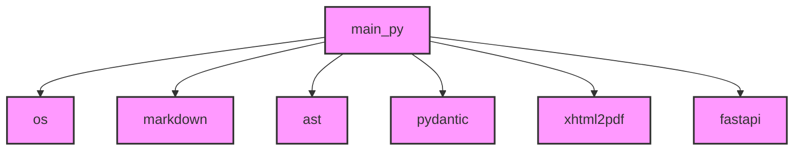

# プロジェクト概要: backend

このドキュメントは、プロジェクトの構造と主要な依存関係を自動生成したものです。

## フォルダ構成

```
└── backend/
  ├── DEVELOPER_GUIDE.md
  ├── DEVELOPER_GUIDE.pdf
  ├── USER_MANUAL.md
  ├── USER_MANUAL.pdf
  ├── backend.log
  ├── backend_project_summary.md
  ├── backend_project_summary.pdf
  ├── main.py
```

## システム依存関係図



## 動作概要

このプロジェクトは、指定されたディレクトリのファイル構造を解析し、Pythonファイルの依存関係を抽出し、その情報を基にMarkdown形式のドキュメントとMermaid形式のシステム依存関係図を生成します。

### 主要な機能:

-   **ディレクトリツリーの生成**: プロジェクト内のファイルとフォルダの階層構造を視覚的に表示します。
-   **Python依存関係の解析**: Pythonソースコード内のインポート文を解析し、ファイル間の依存関係を特定します。
-   **Mermaid図の生成**: 解析された依存関係をMermaid形式のグラフ定義に変換し、視覚的なシステム構成図を提供します。
-   **Webインターフェース**: ユーザーがプロジェクトパスを入力し、生成されたドキュメントをブラウザで確認できるシンプルなWebアプリケーションです。

### 技術スタック:

-   **バックエンド**: Python (FastAPI)
-   **フロントエンド**: React.js
-   **図の描画**: Mermaid.js

このドキュメントは、プロジェクトの全体像を素早く把握するために役立ちます。
